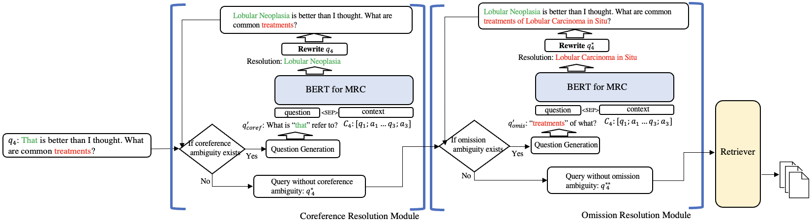

# ZeQR
Offical code for ICTIR'23 paper: Zero-shot Query Reformulation for Conversational Search




If you find this repo to be helpful, please considering cite our paper:
```
@inproceedings{dayu-2023-zeqr,
    author = {Yang, Dayu and Zhang, Yue and Hui, Fang},
    booktitle = {ICTIR 2023: The 13th International Conference on the Theory of Information Retrieval},
    month = {July},
    publisher = {ACM},
    title = {Zero-shot Query Reformulation for Conversational Search},
    year = {2023}}

```


---

# Reproducing results:
1. install dependent packages
```bash
conda env create -f zeqr_env.yml
conda activate zeqr
```
2. create indices
   Since the index files are enormous, we apologize we cannot upload them to github. 
   1. For the download and preprocess instruction, please refer to [TREC CAsT](https://www.treccast.ai/). The data preprocess step is achieved by [trec-cast-tool](https://github.com/grill-lab/trec-cast-tools/tree/master/corpus_processing). The `trec-cast-tool` is basically removing duplicate documents and converting original files to jsonl files. Please git checkout to certain versions of `trec-cast-tool` for different CAsT years. 
   2. After successfully downloading and preprocessing data, the data folder for each CAsT year should be like:

    ```
    - 2019 (~19GB)
        - car.jsonl
        - msmarco_passage_v1.jsonl
        - wp.jsonl
    - 2020 (~16GB)
        - car.jsonl
        - msmarco_passage_v1.jsonl
    - 2021 (~28GB)
        - kilt.jsonl
        - msmarco_document.jsonl
        - wp.jsonl
    - 2022 (~120GB)
        - kilt.jsonl
        - msmarco_passage_v2.jsonl
        - wp.jsonl

    ```
    3. after `.jsonl` files are obtained, indexing using [Pyserini](https://github.com/castorini/pyserini). The [configuration](https://github.com/castorini/pyserini/blob/master/docs/usage-index.md#building-a-dense-vector-index) for indexing really depends on the storage/computational power of your machine. A sample `.sh` file for indexing is like `sample/index/indexing.sh`. (You must create 20 index shreds(0-19) for now. Will update to support arbitrary numbers of shreds later.)
    4. After you have successfully created index, the folder under index/ should be like(assume you create index using tctcolbert dense indexer):
    ```
    - index_tctcolbert
        - dense_2019
            - cast2019_den0
            - cast2019_den1
            - ...
            - cast2019_den18
            - cast2019_den19
                - docid
                - index
        - dense_2020
        - dense_2021
        - dense_2022

    ```

3. fine-tuning BERT for MRC
   1. Option1: train your own BERT for MRC checkpoint by running the script `MRC/train.py` 
   2. Option2: using our checkpoint uploaded in [huggingface](https://huggingface.co/Dylan1999/bert-squad-mrc?context=My+name+is+Clara+and+I+live+in+Berkeley.&question=What%27s+my+name%3F).
4. retrieval
   1. Option1: 
      1. run `ranking_<CAsT_year_to_rank>.sh` to create sub ranking files. Each sub ranking file is a `.pkl` file which is named as `dense[shred_of_index]_[qid].pkl`. (reason to split as many small `.pkl` files is acceleration.)
      2. run `eval_retrieval_results.py`. 
        - It has two arguments. 
            - `name` is the name of your experiment, should be consistent to what you set in the `.sh` script `run_name`
            - `year` is which year of CAsT dataset you are using. Should be `2019`, `2020`, `2021`, or `2022`.
        - This script will automatically combine all the small `.pkl` and output a full ranking file under the `retrieval_sesults/<name_of_your_experiment>/`, name as `<year>.run`.
      3. after the run file is obtained. you can use `eval_sample_results.ipynb` to compute any additional metrics you want.
   2. Option2: skip the ranking step and evaluate the provided `.run` file in `samples/ranking_results`. See Evaluation Step for detail.
5. Evaluation
   1. Option1: run `eval_ranking_results.py --year <year> --run_name <your_experiment_name>` 
      1. in case you want to compute additional metrics, you can use `eval_sample_results.ipynb`.
      2. For CAsT-19, due to some bugs of `trec-cast-tool`, the processed documents (retrieval candidates pool) has some duplicated files. You need to use the official `dedup.py` from `trec-cast-tool` to filter out duplicated docid before using `trec-eval` to evaluation.
      3. For CAsT-21, because the run files submitted by many teams only contains the docid(no passage id). The organizer decided to only evaluate on docid. `trec-cast-tool` provide a `docize.py` script to transform passage id to docid. You need to do this before evaluation.
   2. Option2: directly use the `.run` file I provided in `sample/ranking_results/` to reproduce the experiment results.

---

Please contact me via email (dayu ant udel dot edu) if you have any question. Thanks!

